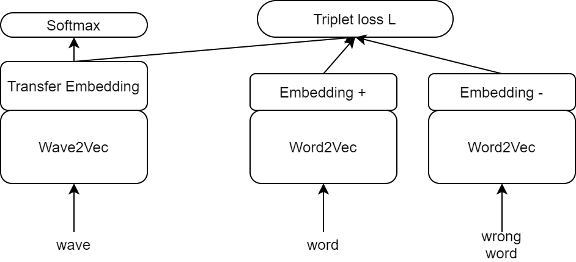
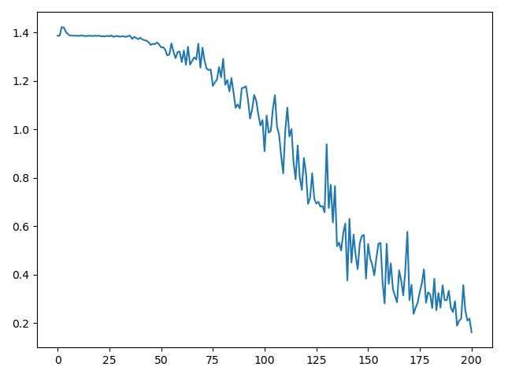

# 02456-deep-learning-corti

https://www.overleaf.com/2288993974qjrnyshhbqrf

https://github.com/andi611/Self-Supervised-Speech-Pretraining-and-Representation-Learning#data-preparation

https://github.com/lucidrains/electra-pytorch

``
pip install torchaudio -f https://download.pytorch.org/whl/torch_stable.html
``

### Get started
``
requirements.txt
``

### The Wave2Word model

### Working with loss
