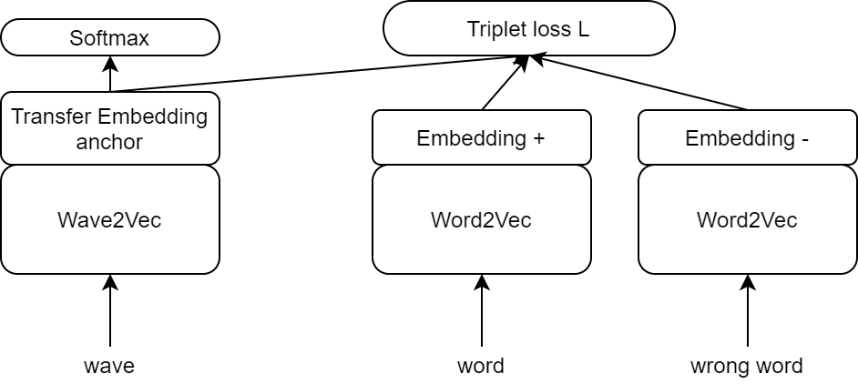

# 02456-deep-learning-corti

Synopsis Report: https://www.overleaf.com/2288993974qjrnyshhbqrf

Poster: https://docs.google.com/presentation/d/1MBlMCGNFhCcRSLpeCTeVssrbzseg8gFOc0NTBz4mMCw/edit?usp=sharing

Report: https://www.overleaf.com/8968338513dbfhhzrcpbfp

https://github.com/andi611/Self-Supervised-Speech-Pretraining-and-Representation-Learning#data-preparation

https://github.com/lucidrains/electra-pytorch

``
pip install torchaudio -f https://download.pytorch.org/whl/torch_stable.html
``

### Get started
``
requirements.txt
``

### The Wave2Word model

### Working with loss

